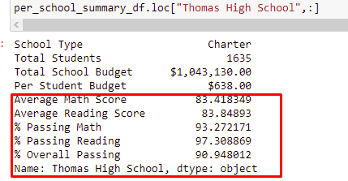

# PyCitySchools Challenge

## Overview of the school district analysis
    We use this analysis to show the information of the schools that are registered in this district, this information could help us to identify some important things such as the budget given, the grades and how the schools and their students are working with some of the courses given. 
    This can help us determine if a school needs more budget or if the grades are poor and the director of this school needs to pay more atention to their teachers and their students.

## Results
1. How is the district summary affected?
    * There is not a big change, only by little numbers such as decimals, because the quantitiy of students is not huge.
2. How is the school summary affected?
    * This one is only affectted in Thomas High School, because there were the students who cheated and their results were changed to NaN. First we can see how the results were without changing ninth graders scores, and the second image is how the summary changed.
    
    

    
    

3. How does replacing the ninth graders' math and reading scores affect Thomas Hisgh School's performance relatice to the other schools?
    * As we saw, Thomas High School was in a really good place, its percentage was high, with more than 90% but with this change, its passing percentage drop between 60% and 70%
    This made the school drop down and now is not in the top of schools, before the change, **Thomas High School** was in the top 5 in betweeen **Cabrera High School** and **Griffin High School** and after the change it drop down.

    

4. How does replacing the ninth-grade scores affect the following:
    * Math and reading scores by grades
        * as we can see the only thing that changed is the fact that wen we see the 9th grade we see a NaN

        
    * Scores by school spending
        * It didn't change at all this data frame
    * Scores by school size
        * We can't see a change in here because we didn't count the 9th graders in this summary and in the next one
    * Scores by school type
        * We can't see a change in here because we didn't count the 9th graders in this summary

## Summary

    * First, we have a change in the position of Thomas High School it move from one of the first place to the last ones.
    * Second, if we dont count the number of 9th graders in Thomas School, the population of this school decreaseas by a hundred.
    * Third, becasue of this the budget per student increases.
    * Fourth, as we didn't count the reading scores and math scores of the ninth graders, the passing reading and math scores from the schhol changes because some of the 9th graders had the highest scores in this courses.
